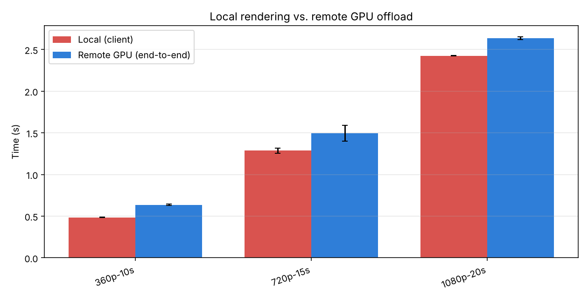
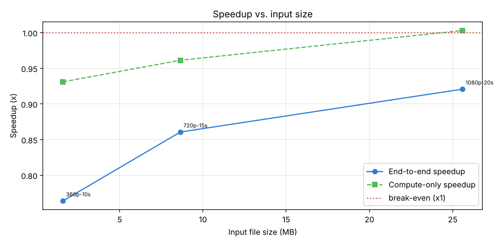
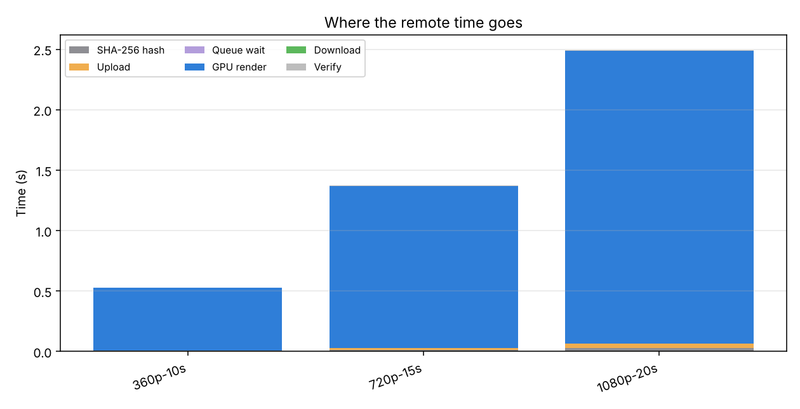
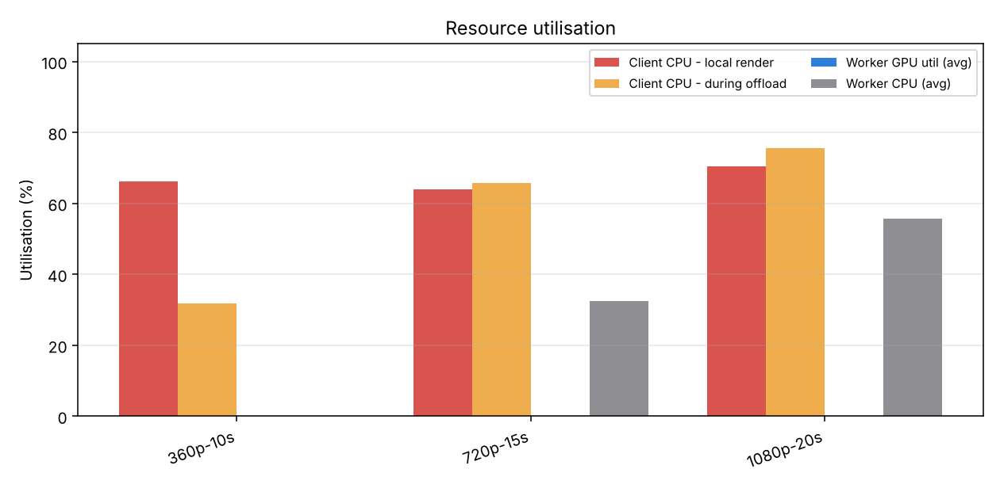

# Performance Evaluation Report - Distributed Task Offloading & Remote GPU Rendering

*Course: CSC-334 Parallel and Distributed Computing - generated 2026-10-04 07:55:22*

## 1. Objective

This report evaluates whether offloading video transcoding from a resource-constrained client laptop to a remote worker with a dedicated NVIDIA GPU (FFmpeg + NVENC) reduces the end-to-end completion time. It quantifies the **speedup**, the **network transfer overhead** and the **resource utilisation** of both machines.

## 2. Experimental setup

| | Client (local baseline) | Worker (remote GPU) |
|---|---|---|
| Description | Sandbox VM (loopback pipeline test) | Same VM (CPU fallback) |
| Host / OS | Linux-6.18.44-fc-v64-x86_64-with-glibc2.39 | vm |
| CPU | x86_64 (2 threads) | see description |
| RAM | 7.8 GB | see description |
| GPU(s) | none detected | none detected |
| Encoder used | libx264 | libx264 (NVENC available: False) |
| FFmpeg | local install | ffmpeg version 6.1.1-3ubuntu5 Copyright (c) 2000-2023 the FFmpeg developers |

> **Warning:** the worker did not use NVENC for these runs (encoder: `libx264`). The numbers below therefore describe CPU-to-CPU offloading and must not be presented as GPU results - re-run the benchmark on a worker with a working NVIDIA GPU.

**Network link:** loopback - target `127.0.0.1`; ping RTT avg **0.08 ms** (min 0.07, max 0.14, jitter 0.02 ms); raw TCP throughput measured by the system: **52986 Mbit/s up / 41063 Mbit/s down**.

**Render settings (identical on both sides):** resolution height `360`, bitrate `1M`, preset `p1`, codec `h264`. Each clip was processed **2x**; values are means (± population std-dev for totals).

## 3. Methodology

* Test clips are synthetic (FFmpeg `testsrc2` + noise, H.264, realistic source bitrate, AAC audio) or user supplied, covering several resolutions and durations (= file sizes).
* **Local run:** the client transcodes the clip with FFmpeg on its own hardware (NVENC if the laptop has one, otherwise libx264/libx265).
* **Remote run:** the client offloads the clip through the custom protocol: SHA-256 hash → upload → worker queue → GPU render → download → SHA-256 verification. All phases are timed (`time.perf_counter`).
* CPU utilisation is sampled once per second with `psutil`; GPU utilisation / VRAM / power on the worker through `nvidia-smi`.
* Definitions: Speedup *S* = T_local / T_remote_total  
Compute-only speedup *S_c* = T_local / T_render_remote  
Network overhead *O_net* = (T_upload + T_download) / T_remote_total  
Integrity overhead *O_int* = (T_hash + T_verify) / T_remote_total  
Break-even bandwidth *B\** = 8·(Size_in + Size_out) / (T_local − T_render_remote)

## 4. Results

### 4.1 Execution time

| Clip | Resolution | Dur. | In (MB) | Out (MB) | Local (s) | Remote total (s) | Remote render (s) | Speedup S | Compute speedup S_c |
|---|---|---|---|---|---|---|---|---|---|
| 360p-10s | 640x360 | 10s | 1.6 | 1.5 | 0.5 ± 0.0 | 0.6 ± 0.0 | 0.5 | **0.76x** | 0.93x |
| 720p-15s | 1280x720 | 15s | 8.6 | 2.1 | 1.3 ± 0.0 | 1.5 ± 0.1 | 1.3 | **0.86x** | 0.96x |
| 1080p-20s | 1920x1080 | 20s | 25.6 | 2.9 | 2.4 ± 0.0 | 2.6 ± 0.0 | 2.4 | **0.92x** | 1.00x |

### 4.2 Network transfer overhead

| Clip | Hash (s) | Upload (s) | Upload Mbit/s | Download (s) | Download Mbit/s | Verify (s) | Network share O_net | Integrity share O_int | Render share |
|---|---|---|---|---|---|---|---|---|---|
| 360p-10s | 0.00 | 0.00 | 2946 | 0.00 | 9023 | 0.00 | 0.9% | 0.5% | 82.1% |
| 720p-15s | 0.01 | 0.02 | 3912 | 0.00 | 8942 | 0.00 | 1.3% | 0.9% | 89.5% |
| 1080p-20s | 0.03 | 0.04 | 5111 | 0.00 | 6550 | 0.00 | 1.7% | 1.2% | 91.8% |

### 4.3 Resource utilisation

| Clip | Client CPU - local (%) | Client CPU - offload (%) | Worker GPU avg / max (%) | Worker VRAM (MB) | Worker GPU power (W) | Worker CPU (%) | Render fps (worker) |
|---|---|---|---|---|---|---|---|
| 360p-10s | 66 | 32 | n/a / n/a | n/a | n/a | 0 | 576 |
| 720p-15s | 64 | 66 | n/a / n/a | n/a | n/a | 32 | 338 |
| 1080p-20s | 70 | 76 | n/a / n/a | n/a | n/a | 56 | 248 |

## 5. Analysis

* **Speedup.** Offloading changed the end-to-end time by a mean factor of **0.85x** (best: **0.92x** on `1080p-20s`, worst: **0.76x** on `360p-10s`). For at least one clip offloading was *slower* than rendering locally - see the break-even analysis below. 
* **Compute-only speedup.** Ignoring all transfers, the worker rendered the clips 0.97x faster than the client on average. This is the upper bound of what offloading can achieve; the gap to the end-to-end figure is the cost of moving data.
* **Network & integrity overhead.** On average **1.3%** of the remote time was spent transferring data (upload + download) and **0.9%** on SHA-256 integrity checks, while **87.8%** was the actual remote rendering. The transfer cost is small compared to the compute time, so offloading scales well.
* **Effect of file size / resolution.** From `360p-10s` (1.6 MB) to `1080p-20s` (25.6 MB) the end-to-end speedup increases from 0.76x to 0.92x. Small jobs pay the fixed costs (connection set-up, hashing, queueing, process start-up) with little compute to amortise them; heavy jobs (higher resolution, longer duration) benefit most because compute grows faster than the bytes that must be moved.
* **Break-even bandwidth.** Offloading pays off as long as the link is faster than B* = 8·(S_in+S_out)/(T_local−T_render). The most demanding case (`1080p-20s`) needs at least **32505.1 Mbit/s**; the measured link (41063 Mbit/s) is 1.3x above that. This is why a direct CAT6 link is preferable to congested Wi-Fi.
* **Client resources.** During local rendering the client CPU averaged **67%**; while offloading it was **58%**; the client CPU is still busy during offloading (hashing, socket I/O and, in this run, possibly the worker sharing the same machine), so no large relief is visible.
* **Robustness.** 0 network retries were needed during the benchmark; every transfer was verified by SHA-256 and all results were accepted.

## 6. Discussion

**Why offloading can win.** Hardware encoders (NVENC) are ASICs built into the GPU; they encode H.264/HEVC far faster and with much less power than software encoders on a laptop CPU. Offloading converts the problem into `T_remote = T_hash + T_up + T_queue + T_render + T_down + T_verify`. As long as `T_up + T_down + overheads < T_local − T_render`, the user gains time, and the laptop is free for other work.

**Limits (Amdahl-style).** The transfer and integrity phases are serial and independent of GPU speed, so even an infinitely fast GPU cannot beat `S_max = T_local / (T_hash + T_up + T_down + T_verify)`. Output size depends on the chosen bitrate, so a high target bitrate increases download time.

**Possible improvements.** (1) Pipeline: start rendering while the upload is still in progress (chunked/streaming transcode); (2) compress or use a lossless-friendly container for upload; (3) use jumbo frames on the direct link; (4) run several jobs concurrently on GPUs that allow multiple NVENC sessions; (5) overlap hashing with upload.

## 7. Conclusion

For the tested workloads offloading was NOT faster than local rendering under these conditions: mean end-to-end speedup **0.85x**, with a mean network share of **1.3%** of the total time. The custom protocol provided latency checking, authenticated sessions, integrity validation, resumable transfers and live progress streaming.

---
*Raw data: `results.json`, `results.csv`. Regenerate this report with `python benchmark/report.py results.json`.*